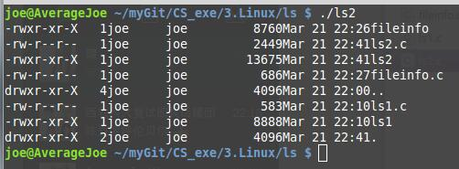

Linux常用命令
==============

##一.Linux下有两种用户：超级用户（root）、普通用户。
+ a)超级用户：可以再linux系统下做任何事情，不受限制。
+ b)普通用户：在linux下做有限的事情。

> 超级用户的命令提示符是“#”，普通用户的命令提示符是“$”。

+ 命令：su  [用户名] 
+ 功能：切换用户。

> 例如，要从root用户切换到普通用户user，则使用 su user。
> 要从普通用户user切换到root用户则使用 su root（root可以省略），此时系统会提示输入root用户的口令。


##二.添加用户。


```shell
#命令：
useradd #用户名
#功能：添加一个普通用户。
#例如，要想添加一个普通用户user1 ， 则可以使用
useradd  user1
#使用该命令后，系统会在 目录“/home”下建立一个名为 user1 的目录。
#加 -m才会创建目录
```

##三.设置密码

```shell
#命令：
#passwd #用户名
#功能：设置或修改用户名的密码。
#例如，我们要给刚才创建的user1用户设置一个密码123456，则使用 #passwd user1
#然后系统会提示你输入新密码。
```

##四.查看文件或目录

####1.原型

```shell
#命令：
ls #[选项] #[目录或文件]
#功能：对于目录，该命令列出该目录下的所有子目录与文件。对于文件，将列出文件名以及其他信息。Linux文件系统不是根据后缀名来执行文件的，而是根据此文件是否有可执行权限。
```

####2.常用的选项有

+ ls -a  显示指定目录下所有子目录与文件。例如 列出“/root/home”目录下的所有子目录及文件，则使用 ls –a  /root/home 。
+ ls -l  列出指定目录下所有目录及文件的详细信息。例如 列出“/root/home”目录下的所有子目录及文件，则使用 ls  –l  /root/home 。

###3.ls -l 每行列出的详细信息详解

> 例子

```shell
joe@AverageJoe ~/myGit/CS_exe/3.Linux $ ls -l
total 32
drwxr-xr-x 2 joe joe 4096 Mar 27 12:51 1.LinuxBasicCommand
drwxr-xr-x 3 joe joe 4096 Mar 16 17:13 BLP
drwxr-xr-x 2 joe joe 4096 Mar 23 09:40 file
drwxr-xr-x 2 joe joe 4096 Mar 25 09:47 GDB
drwxr-xr-x 2 joe joe 4096 Mar 25 20:45 IPC
drwxr-xr-x 2 joe joe 4096 Mar 24 18:11 nmap
drwxr-xr-x 2 joe joe 4096 Mar 25 19:59 ProcessControl
-rw-r--r-- 1 joe joe  109 Mar 27 12:45 README.md
```
> 详解

+　1.文件类型

> 其中第一个字符表示文件类型，它可以是下列类型之一

|第一个字母的类型|解释|
|----|-------------|
|-	|普通文件|
|d	|目录|
|l	|符号链接|
|b	|块设备文件|
|c	|字符设备文件|
|p	|命名管道|
|s	|socket文件|

+ 2.权限 

> 后面的9个字符表示文件的访问权限，分为3组，每组3位,第一组表示文件创建者的权限，第二组表示同组用户的权限，第三组表示其他用户的权限。每一组的三个字符分别表示对文件的读、写、执行权限。

> 各权限如下：r（读）、w（写）、x（执行）、_（没有设置权限）。每一组可以用一个数字表示，例如 r_x : 5 , rw_:6


> R__:4，那么这三组就可以用3个数字表示，例如rwxr_xr_x:755  ， rw_r__r__:644,为八进制数


> ls输出内容是有颜色的，比如：目录是蓝色，压缩文件是红色的显示，如果没有颜色，可以加上参数--color=never 表示输出没有彩色，而--color=auto 表示自动，--color=always表示始终有颜色

+　3.连接数 
+　4.文件所有者 
+　5.文件所属组 
+ 6.文件大小 
+ 7.最近修改时间 
+ 8.文件名字。


##五.改变工作目录。

```shell
#命令
cd #目录名
#功能：改变工作目录。将当前工作目录改变到指定的目录下，例如要切换当前目录到“/home/user/0718”目录，则使用
cd  /home/user/0718。
```

> 常用的切换目录命令：

|常用切换目录命令命令|解释|
|------------|--------------|
|cd .. |到父目录|
|cd / |到根目录|
|cd ~ |到用户主目录下~	与直接执行cd 效果一样|
|cd -| 到上一次目录|


##六.显示当前工作目录。
```shell
#命令	：
pwd
#功能	：	显示用户当前所在的目录。例如当我们使用命令
cd  /home/user/0718 
#时，再使用命令 pwd 则命令行会显示
/home/user/0718
```

##七.创建目录

```shell
#命令：
mkdir [选项] dirname
#功能：在当前目录下创建一个名为 “dirname”的目录。例如要在当前目录下创建一个名为“07181”的目录，则使用命令
mkdir 07181
#系统就会在当前目录下，创建一个07181的目录，此时可以使用 ls –l 查看。
```

##八.删除目录

```shell
#命令：
rmdir [选项] dirname
#功能：在当前工作目录下删除目录名为“dirname”的子目录。此时该子目录必须是个空目录。我们刚才创建了一个空目录07181，如果我们想把它删掉，则使用 rmdir 07181 。此时再使用ls –l 列举一下，这时发现07181 已经被删掉了。如果使用该命令删除一个非空的目录，则删除失败。
```

##九.拷贝文件或目录

```shell
#命令
cp [选项] 源文件或目录 目标文件或目录
#功能：把指定的源文件复制到目标文件或把多个源文件复制到目标目录中。
```

> 常用选项参数：

```shell
cp -f  
#若目标目录中存在与源文件同名的文件，则直接覆盖，不提示。例如将当前目录下的main.c文件拷贝到“/home/user/0718”下，并且若存在同名的则进行覆盖，使用：
cp -f ./main.c  /home/user/0718 。
#如果在拷贝的同时将源文件重命名，例如将当前目录下的main.c文件拷贝到“/home/user/0718”目录下并命名为main1.c，则使用：
 cp  -f  ./main.c  /home/user/0718/main1.c。
# -i	和-f相反，当目标文件中存在于源文件同名的文件，copy时系统会提示是否进行覆盖。里如上例，若在拷贝过程中，目标文件中存在与源文件同名的文件，需要提示是否覆盖，则只需要将上例中的-f 改为 –I 即可。例如
cp  –i  ./main.c  /home/user/0718 。
cp  –i  ./main.c  /home/user/0718/main1.c。
#-r 如果要拷贝的是一个目录，此时将同时拷贝该目录下的子目录和文件。此时目标文件必须为一个目录。例如，将”/home/user/0718”目录下的所有文件及目录拷贝到“/home/user1”目录下，则使用 
cp  –r  /home/user/0718  /home/user1 。#重点
```

##十.10．移动文件或目录。

```shell
#命令：
mv [选项] 源文件或目录 目标文件或目录
#功能：视mv命令中第二个参数类型的不同（是目标文件还是目标目录），mv命令将文件重命名或将其移至一个新的目录中。当第二个参数类型是文件时，mv命令完成文件重命名，此时，源文件只能有一个（也可以是源目录名），它将所给的源文件或目录重命名为给定的目标文件名。当第二个参数是已存在的目录名称时，源文件或目录参数可以有多个，mv命令将各参数指定的源文件均移至目标目录中。在跨文件系统移动文件时，mv先拷贝，再将原有文件删除，而链至该文件的链接也将丢失。
```

> 参数

```shell
-i #如果在移动的过程中存在重名的，则进行提示是否覆盖。
-f #若果在移动的过程中存在重名的，则直接进行覆盖，不会给出提示。

#例如 要将 “/home/user/0718”下的main.c 文件重命名为main.cpp，则使用 
mv  /home/user/0718/main.c   /home/user/0718/main.cpp。

#要将“/home/user/0718”下的所有内容移动到 “/home/user/0719”,则使用
mv  –f  /home/user/0718  /home/user/0719。
```


##十一.删除文件或目录

```shell
#命令
rm [选项] 文件或目录
#功能：在linux中创建文件很容易，系统中随时会有文件变得过时且毫无用处。用户可以用rm命令将其删除。该命令的功能为删除一个目录中的一个或多个文件或目录，它也可以将某个目录及其下的所有文件及子目录均删除。对于链接文件，只是删除了链接，原有文件均保持不变。如果删除时没有-r选项则不会杀出目录。
```

> 参数

```shell
-f #删除过程中不会给出提示。
-i #删除过程中会给出交互式提示。
-r #如果删除的是一个目录，则将该目录下的目录及子目录均删除掉。
#例如要删除 “/home/user/0718”目录下的main.cc  main.exe则使用
rm -f /home/user/0718/main.cc  /home/user/0718/main.exe 
#若果要删除“/home/user/0718”这个目录，则使用
rm  –rf  /home/user/0718。
```


##十二.查看文件内容

```shell
#命令
cat [选项] [文件]
#功能： 查看目标文件的内容
```
> 参数

```shell
-b #对非空输出行编号
-E #在每行结束处显示$
-n #对输出的所有行编号
-s #不输出多行空行。
#例如 要查看当前目录下的main.cc 的内容则使用
cat  main.cc
```

> 标准的输入输出与重定向：

文件描述符是一个整数,它代表一个打开的文件,标准的三个描述符号:

+ 标准输入：一般指键盘,描述符为：0
+ 标准输出：一般指屏幕输出,描述符为：1
+ 错误输出：也是屏幕,描述符为：2

> 重定向符号:

```shell
< #重定向输入
> #重定向输出
>> #添加输出
2> #错误重定向
&> #错误和信息重定向
```
> 例子

```shell
Cat >file1<file2
./main text1.txt >text5.txt 2>&1
#cat常常与重定向一起使用。其中>表示创建，>>表示追加,<<表示以什么结束
#如果cat的命令行中没有参数，它就会从标准输入中读取数据，并将其送到标准输出。
```
> linux中创建空文件的四种方式：

```shell
#方式1
echo > a.txt #（好像会有一个字节）

#方式2
touch b.txt

#方式3
cat > c.txt #按ctrl+c组合键退出；或Ctrl+d

#方式4
#vi d.txt #进入之后：wq退出。
```


##十三.显示文件内容的前几行

```shell
#命令
head –n 行数值 文件名
#功能：显示目标文件的前几行。
#例如 要显示 当前目录下main.cc 的前10行，则使用
head  –n  10 main.cc
```


##十四.显示文件的后几行

```shell
#命令
tail –n 行数值 文件名。
#功能：显示目标文件的最后几行。
#例如 要显示“/home/user/0718/”目录下的main.cc 文件的最后10行。则使用 
tail  –n  10  /home/user/0718/main.cc
```

##十五.管道与命令替换

> 管道：是重定向的一种，就像一个导管一样，将一个程序或命令的输出作为另一个程序或命令的输入。

```shell
ls –l /etc | wc –w
```

> 命令替换：和重定向有点相似，但区别在于命令替换是将一个命令的输出作为另一个命令的参数。常用的格式为 : command1 `command2`或command1 $(command2)

> 举例

```shell
#首先列出当前的所有信息，并重定向到aa文件中：
ls | cat > aa	
#或
ls > aa


#然后，通过命令替换，列出aa文件中所有的文件信息
ls –l `cat aa` 
#或者用 
ls –l $(cat aa)
```


##十六.文件或目录的创建掩码

> umask指文件（0666）或目录（0777）创建时在全部权限中要去掉的一些权限，普通用户缺省时umask的值为002，超级用户为022。

> 002表示创建目录时所有者的权限不去掉， 所属组权限不去掉，其他组权限写属性去掉

+ 创建一文件以后，普通用户缺省的权限为664            

> 超级用户：  644

+ 创建一目录以后，普通用户缺省的权限为775                   

> 超级用户：  755

> 可以通过umask查看默认的缺省的掩码值。通过umask 001修改掩码值。


##十七.改变目录或文件的权限


####1.原型

+ 功能：chmod命令是非常重要的，用于改变文件或目录的访问权限。用户用它控制文件或目录的访问权限。
+ 语法：该命令有两种用法。一种是包含字母和操作符表达式的文字设定法；另一种是包含数字的数字设定法。
+ 说明：我们利用ls –l长格式列出文件或目录的基本信息如下：

> 文件类型与权限 链接数 文件所有者 文件属组 文件大小 最近修改的时间 名字

####2.权限说明

> 对于权限，有第一组表示文件所有者的权限，第二组表示同组用户的权限，第三组表示其他用户的权限。每一组的三个字符分别表示对文件的读、写和执行权限。可以通过chmod来修改权限。

+ 1. 文字设定法

```shell
chmod [who][+|-|=][mode] 文件名
#修改指定文件名中who的权限增加/去除/赋值为mode
```

> 参数：
+ 操作对象who可是下述字母中的任一个或者它们的组合：


u 表示“用户（user）”，即文件或目录的所有者。
g 表示“同组（group）用户”，即与文件所有者有相同组ID的所有用户。
o 表示“其他（others）用户”。
a 表示“所有（all）用户”。它是系统默认值。即chmod +x 1.c表示所有人都有可执行的权限。

+ 操作符号可以是：
```shell
+ #添加某个权限。
- #取消某个权限。
= #赋予给定权限并取消其他所有权限（如果有的话）。
```

> 设置mode所表示的权限可用下述字母的任意组合(当组合的时候，who不能少)：

```shell
r #可读
w #可写
x #可执行
```
> 文件名：以空格分开的要改变权限的文件列表，支持通配符。
> 在一个命令行中可给出多个权限方式，其间用逗号隔开。例如：chmod g+r，o+r example使同组和其他用户对文件example 有读权限。

+ 2. 数字设定法
> 我们必须首先了解用数字表示的属性的含义：0表示没有权限，1表示可执行权限，2表示可写权限，4表示可读权限，然后将其相加。所以数字属性的格式应为3个从0到7的八进制数，其顺序是（u）（g）（o）。

> 例如，如果想让某个文件的所有者有"读/写"二种权限，需要把4（可读）+2（可写）＝6（读/写).
> 数字设定法的一般形式为：chmod [mode] 文件名

+ 例子

```shell
#(1).文字设定法：
chmod a+x sort
#即设定文件sort的属性为：
#文件所有者（u） 增加执行权限
#与文件所有者同组用户（g） 增加执行权限


#其他用户（o） 增加执行权限
chmod ug+w，o-x text
#即设定文件text的属性为：文件所有者（u） 增加写权限,与文件所有者同组用户（g） 增加写权限
　　
#其他用户（o） 删除执行权限
chmod a–x mm.txt
chmod –x mm.txt
chmod ugo–x mm.txt
#以上这三个命令都是将文件mm.txt的执行权限删除，它设定的对象为所有使用者。


#（2）数字设定法：
chmod 644 mm.txt
ls –l
#即设定文件mm.txt的属性为：
-rw-r--r-- 1 inin users 1155 Nov 5 11:22 mm.txt
#文件所有者（u）inin 拥有读、写权限
#与文件所有者同组人用户（g） 拥有读权限

#其他人（o） 拥有读权限
chmod 750 wch.txt
ls –l
-rwxr-x--- 1 inin users 44137 Nov 12 9:22 wchtxt
#即设定wchtxt这个文件的属性为：
#文件主本人（u）inin 可读/可写/可执行权
#与文件主同组人（g） 可读/可执行权
#其他人（o） 没有任何权限
```


本代码是实现linux中的ls -l的功能
===============

###1.[普通的ls功能](ls1.c)

```c
#include<stdio.h>
#include<sys/types.h>
#include<dirent.h>

void do_ls(char dirname[])
{
     DIR *dir_ptr;
     struct dirent *direntp;

     if((dir_ptr = opendir(dirname))== NULL)
        fprintf(stderr, "ls1:cannot open %s\n", dirname);
     else
     {
        while((direntp = readdir(dir_ptr)) != NULL)
            printf("%s\n", direntp->d_name);
        closedir(dir_ptr);
     }
     
}

void main(int argc, char *argv[])
{
    if(argc == 1)
        do_ls(".");
    else
        while(--argc){
            printf("%s:\n", *++argv);
            do_ls(*argv);
        }
}

```

###2.[文件属性](fileinfo.c)

```c
///$ ./fileinfo 文件名


#include<stdio.h>
#include<sys/types.h>
#include<sys/stat.h>


void show_stat_info(char * fname,struct stat *buf)
{
    printf("  mode:  %o\n",buf->st_mode);
    printf(" links:  %d\n",buf->st_nlink);
    printf("  user:  %d\n",buf->st_uid);
    printf("  group: %d\n",buf->st_gid);
    printf("   size: %d\n",buf->st_size);
    printf("modtime: %d\n",buf->st_mtime);
    printf("  group: %s\n",fname);
}


int main(int argc, char *argv[])
{
    struct stat info;
    if(argc > 1){
        if(stat(argv[1], &info) != -1)
        {
            show_stat_info(argv[1], &info);
            return 0;
        }
    }else
        perror(argv[1]);
    return 1;
}
```


###3.[实现ls -l的功能]

```c
#include<stdio.h>
#include<sys/types.h>
#include<dirent.h>
#include<sys/stat.h>

void do_ls(char[]);
void dostat(char *);
void show_file_info(char *,struct stat *);
void mode_to_letters(int ,char[]);
char * uid_to_name(uid_t);
char * gid_to_name(gid_t);


main(int ac,char *av[])
{
    if(ac==1)
        do_ls(".");
    else
    while(--ac){
        printf("%s:\n",*++av);
        do_ls;
    }
}


void do_ls(char dirname[])
/*
 * list files in directory called dirname
 */

 {
    DIR *dir_ptr;
    struct dirent *direntp;

    if((dir_ptr=opendir(dirname))==NULL)
        fprintf(stderr,"ls1:cannot open %s\n",dirname);
    else
    {
        while((direntp=readdir(dir_ptr))!=NULL)
        dostat(direntp->d_name);
        closedir(dir_ptr);
    }
 }

void dostat(char *filename)
{
    struct stat info;
    if(stat(filename,&info)==-1)
        perror(filename);
    else
        show_file_info(filename,&info);
}

void show_file_info(char * filename,struct stat * info_p)
{
    char * uid_to_name(), *ctime(),*gid_to_name();
    void mode_to_letters();
    char modestr[11];

    mode_to_letters(info_p->st_mode,modestr);

    printf("%s",modestr);
    printf("%4d",(int) info_p->st_nlink );
    printf("% -8s", uid_to_name(info_p->st_uid));
    printf("% -8s",gid_to_name(info_p->st_gid));
    printf("%8ld", (long)info_p->st_size);
    printf("%.12s", 4+ctime(&info_p->st_mtime));
    printf("%s\n", filename);
}


void mode_to_letters(int mode,char str[])
{
    strcpy(str,"----------");
    if(S_ISDIR(mode)) str[0]='d';
    if(S_ISCHR(mode)) str[0]='c';
    if(S_ISBLK(mode)) str[0]='b';

    if(mode & S_IRUSR) str[1]='r';
    if(mode & S_IWUSR) str[2]='w';
    if(mode & S_IXUSR) str[3]='x';

    if(mode & S_IRGRP) str[4]='r';
    if(mode & S_IWGRP) str[5]='w';
    if(mode & S_IXGRP) str[6]='x';


    if(mode & S_IROTH) str[7]='r';
    if(mode & S_IWOTH) str[8]='w';
    if(mode & S_IXOTH) str[9]='X';
}

#include <pwd.h>

char * uid_to_name(uid_t uid)
{
    struct passwd * getpwuid(), *pw_ptr;
    static char numstr[10];

    if((pw_ptr=getpwuid(uid))==NULL){
        sprintf(numstr,"%d",uid);
        return numstr;
    }
    else
        return pw_ptr->pw_name;
}

#include <grp.h>
char * gid_to_name(gid_t gid)
{
    struct group * getgrgid(), *grp_ptr;
    static char numstr[10];

    if((grp_ptr=getgrgid(gid))==NULL){
        sprintf(numstr,"%d",gid);
        return numstr;
    }
    else
        return grp_ptr->gr_name;
}
```


