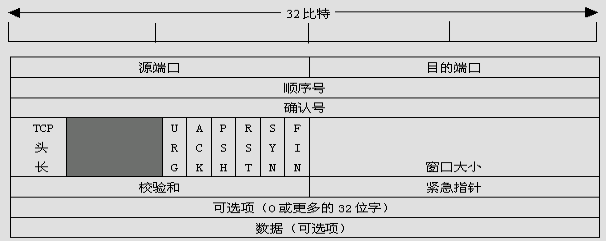
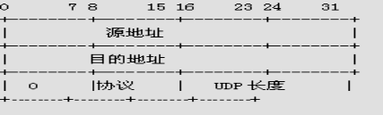

Linux网络编程
===================

##1.0TCP/IP协议概述

> 协议protocol：通信双方必须遵循的规矩 由iso规定  rpc文档

+ osi参考模型：（应-表r-会-传-网-数-物）
+ 应用层 表示层 会话层 传输层 网络层 数据链路层 物理层

####1.0.1.TCP/IP模型4层

+ 应用层{http超文本传输协议 ftp文件传输协议 telnet远程登录ssh安全外壳协议stmp简单邮件发送 pop3收邮件}

+ 传输层{tcp传输控制协议,udp用户数据包协议} 

+ 网络层{ip网际互联协议 icmp网络控制消息协议 igmp网络组管理协议}

+ 网络接口层{arp地址转换协议,rarp反向地址转换协议，mpls多协议标签交换}

####1.0.2.TCP/UDP协议

+ TCP协议：传输控制协议 面向连接的协议 能保证传输安全可靠 速度慢（有3次握手）

+ UDP协议：用户数据包协议 非面向连接  速度快 不可靠

> 通常是ip地址后面跟上端口号：ip用来定位主机 port区别应用（进程）
> http的端口号80 ssh-->22 telnet-->23 ftp-->21  用户自己定义的通常要大于1024

##1.2.OSI参考模型及TCP/IP参考模型

####1.2.1.TCP/IP协议族的每一层的作用：
+ 网络接口层：负责将二进制流转换为数据帧，并进行数据帧的发送和接收。要注意的是数据帧是独立的网络信息传输单元。

+ 网络层：负责将数据帧封装成IP数据报，并运行必要的路由算法。

+ 传输层：负责端对端之间的通信会话连接和建立。传输协议的选择根据数据传输方式而定。

+ 应用层：负责应用程序的网络访问，这里通过端口号来识别各个不同的进程。

####1.2.2.TCP/IP协议族的每一层协议的相关注解：

+ ARP：（地址转换协议）用于获得同一物理网络中的硬件主机地址。

+ MPLS：（多协议标签交换）很有发展前景的下一代网络协议。

+ IP：（网际互联协议）负责在主机和网络之间寻址和路由数据包。

+ ICMP：（网络控制消息协议）用于发送报告有关数据包的传送错误的协议。

+ IGMP：（网络组管理协议）被IP主机用来向本地多路广播路由器报告主机组成员的协议。

+ TCP：（传输控制协议）为应用程序提供可靠的通信连接。适合于一次传输大批数据的情况。并适用于要求得到响应的应用程序。

+ UDP：（用户数据包协议）提供了无连接通信，且不对传送包进行可靠的保证。适合于一次传输少量数据。

##1.3.TCP协议

####1.3.1.概述

+ TCP是TCP/IP体系中面向连接的运输层协议，它提供全双工和可靠交付的服务。它采用许多机制来确保端到端结点之间的可靠数据传输，如采用序列号、确认重传、滑动窗口等。

+ 首先，TCP要为所发送的每一个报文段加上序列号，保证每一个报文段能被接收方接收，并只被正确的接收一次。

+ 其次，TCP采用具有重传功能的积极确认技术作为可靠数据流传输服务的基础。这里“确认”是指接收端在正确收到报文段之后向发送端回送一个确认（ACK）信息。发送方将每个已发送的报文段备份在自己的缓冲区里，而且在收到相应的确认之前是不会丢弃所保存的报文段的。“积极”是指发送发在每一个报文段发送完毕的同时启动一个定时器，加入定时器的定时期满而关于报文段的确认信息还没有达到，则发送发认为该报文段已经丢失并主动重发。为了避免由于网络延时引起迟到的确认和重复的确认，TCP规定在确认信息中捎带一个报文段的序号，使接收方能正确的将报文段与确认联系起来。

+ 最后，采用可变长的滑动窗口协议进行流量控制，以防止由于发送端与接收端之间的不匹配而引起的数据丢失。这里所采用的滑动窗口协议与数据链路层的滑动窗口协议在工作原理上完全相同，唯一的区别在于滑动窗口协议用于传输层是为了在端对端节点之间实现流量控制，而用于数据链路层是为了在相邻节点之间实现流量控制。TCP采用可变长的滑动窗口，使得发送端与接收端可根据自己的CPU和数据缓存资源对数据发送和接收能力来进行动态调整，从而灵活性更强，也更合理。

####1.3.2.三次握手协议

在利用TCP实现源主机和目的主机通信时，目的主机必须同意，否则TCP连接无法建立。为了确保TCP连接的成功建立，TCP采用了一种称为三次握手的方式，三次握手方式使得“序号/确认号”系统能够正常工作，从而使它们的序号达成同步。如果三次握手成功，则连接建立成功，可以开始传送数据信息。

> 其三次握手分别为：

+ 源主机A的TCP向主机B发送连接请求报文段，其首部中的SYN（同步）标志位应置为1，表示想跟目标主机B建立连接，进行通信，并发送一个同步序列号X（例：SEQ=100）进行同步，表明在后面传送数据时的第一个数据字节的序号为X+1（即101）。

+ 目标主机B的TCP收到连接请求报文段后，如同意，则发回确认。再确认报中应将ACK位和SYN位置为1.确认号为X+1，同时也为自己选择一个序号Y。

+ 源主机A的TCP收到目标主机B的确认后要想目标主机B给出确认。其ACK置为1，确认号为Y+1，而自己的序号为X+1。TCP的标准规定，SYN置1的报文段要消耗掉一个序号。

+ 运行客户进程的源主机A的TCP通知上层应用进程，连接已经建立。当源主机A向目标主机B发送第一个数据报文段时，其序号仍为X+1，因为前一个确认报文段并不消耗序号。

+ 当运行服务进程的目标主机B的TCP收到源主机A的确认后，也通知其上层应用进程，连接已经建立。至此建立了一个全双工的连接。

+ 三次握手：为应用程序提供可靠的通信连接。适合于一次传输大批数据的情况。并适用于要求得到响应的应用程序。

####1.3.3.TCP数据报头

+ 源端口、目的端口：16位长。标识出远端和本地的端口号。

+ 序号：32位长。标识发送的数据报的顺序。

+ 确认号：32位长。希望收到的下一个数据报的序列号。

+ TCP头长：4位长。表明TCP头中包含多少个32位字。

+ 6位未用。

+ ACK：ACK位置1表明确认号是合法的。如果ACK为0，那么数据报不包含确认信息，确认字段被省略。

+ PSH：表示是带有PUSH标志的数据。接收方因此请求数据报一到便可送往应用程序而不必等到缓冲区装满时才发送。

+ RST：用于复位由于主机崩溃或其他原因而出现的错误的连接。还可以用于拒绝非法的数据报或拒绝连接请求。

+ SYN：用于建立连接。

+ FIN：用于释放连接。

+ 窗口大小：16位长。窗口大小字段表示在确认了字节之后还可以发送多少个字节。

+ 校验和：16位长。是为了确保高可靠性而设置的。它校验头部、数据和伪TCP头部之和。

+ 可选项：0个或多个32位字。包括最大TCP载荷，窗口比例、选择重复数据报等选项。

##1.4.UDP协议

####1.4.1概述

+ UDP即用户数据报协议，它是一种无连接协议，因此不需要像TCP那样通过三次握手来建立一个连接。同时，一个UDP应用可同时作为应用的客户或服务器方。由于UDP协议并不需要建立一个明确的连接，因此建立UDP应用要比建立TCP应用简单得多。

+ 它比TCP协议更为高效，也能更好地解决实时性的问题。如今，包括网络视频会议系统在内的众多的客户/服务器模式的网络应用都使用UDP协议。

####1.4.2.Udp数据包头格式

##1.5.协议的选择

####1.5.1.对数据可靠性的要求
	对数据要求高可靠性的应用需选择TCP协议，如验证、密码字段的传送都是不允许出错的，而对数据的可靠性要求不那么高的应用可选择UDP传送。

####1.5.2.应用的实时性
	TCP协议在传送过程中要使用三次握手、重传确认等手段来保证数据传输的可靠性。使用TCP协议会有较大的时延，因此不适合对实时性要求较高的应用，如VOIP、视频监控等。相反，UDP协议则在这些应用中能发挥很好的作用。

####1.5.3.网络的可靠性
	由于TCP协议的提出主要是解决网络的可靠性问题，它通过各种机制来减少错误发生的概率。因此，在网络状况不是很好的情况下需选用TCP协议（如在广域网等情况），但是若在网络状况很好的情况下（如局域网等）就不需要再采用TCP协议，而建议选择UDP协议来减少网络负荷。
	
	
##2.0.socket

-----------------------------------------
##遇到的问题
1.点分十进制和二进制的ip地址转换，大小端转换
2.地址格式转化
-----------------------------------------
