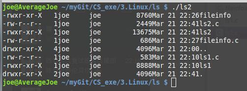

本代码是实现linux中的ls -l的功能
===============

###1.[普通的ls功能](ls1.c)

```c
#include<stdio.h>
#include<sys/types.h>
#include<dirent.h>

void do_ls(char dirname[])
{
     DIR *dir_ptr;
     struct dirent *direntp;

     if((dir_ptr = opendir(dirname))== NULL)
        fprintf(stderr, "ls1:cannot open %s\n", dirname);
     else
     {
        while((direntp = readdir(dir_ptr)) != NULL)
            printf("%s\n", direntp->d_name);
        closedir(dir_ptr);
     }
     
}

void main(int argc, char *argv[])
{
    if(argc == 1)
        do_ls(".");
    else
        while(--argc){
            printf("%s:\n", *++argv);
            do_ls(*argv);
        }
}

```

###2.[文件属性](fileinfo.c)

```c
///$ ./fileinfo 文件名


#include<stdio.h>
#include<sys/types.h>
#include<sys/stat.h>


void show_stat_info(char * fname,struct stat *buf)
{
    printf("  mode:  %o\n",buf->st_mode);
    printf(" links:  %d\n",buf->st_nlink);
    printf("  user:  %d\n",buf->st_uid);
    printf("  group: %d\n",buf->st_gid);
    printf("   size: %d\n",buf->st_size);
    printf("modtime: %d\n",buf->st_mtime);
    printf("  group: %s\n",fname);
}


int main(int argc, char *argv[])
{
    struct stat info;
    if(argc > 1){
        if(stat(argv[1], &info) != -1)
        {
            show_stat_info(argv[1], &info);
            return 0;
        }
    }else
        perror(argv[1]);
    return 1;
}
```


###3.[实现ls -l的功能]

```c
#include<stdio.h>
#include<sys/types.h>
#include<dirent.h>
#include<sys/stat.h>

void do_ls(char[]);
void dostat(char *);
void show_file_info(char *,struct stat *);
void mode_to_letters(int ,char[]);
char * uid_to_name(uid_t);
char * gid_to_name(gid_t);


main(int ac,char *av[])
{
    if(ac==1)
        do_ls(".");
    else
    while(--ac){
        printf("%s:\n",*++av);
        do_ls;
    }
}


void do_ls(char dirname[])
/*
 * list files in directory called dirname
 */

 {
    DIR *dir_ptr;
    struct dirent *direntp;

    if((dir_ptr=opendir(dirname))==NULL)
        fprintf(stderr,"ls1:cannot open %s\n",dirname);
    else
    {
        while((direntp=readdir(dir_ptr))!=NULL)
        dostat(direntp->d_name);
        closedir(dir_ptr);
    }
 }

void dostat(char *filename)
{
    struct stat info;
    if(stat(filename,&info)==-1)
        perror(filename);
    else
        show_file_info(filename,&info);
}

void show_file_info(char * filename,struct stat * info_p)
{
    char * uid_to_name(), *ctime(),*gid_to_name();
    void mode_to_letters();
    char modestr[11];

    mode_to_letters(info_p->st_mode,modestr);

    printf("%s",modestr);
    printf("%4d",(int) info_p->st_nlink );
    printf("% -8s", uid_to_name(info_p->st_uid));
    printf("% -8s",gid_to_name(info_p->st_gid));
    printf("%8ld", (long)info_p->st_size);
    printf("%.12s", 4+ctime(&info_p->st_mtime));
    printf("%s\n", filename);
}


void mode_to_letters(int mode,char str[])
{
    strcpy(str,"----------");
    if(S_ISDIR(mode)) str[0]='d';
    if(S_ISCHR(mode)) str[0]='c';
    if(S_ISBLK(mode)) str[0]='b';

    if(mode & S_IRUSR) str[1]='r';
    if(mode & S_IWUSR) str[2]='w';
    if(mode & S_IXUSR) str[3]='x';

    if(mode & S_IRGRP) str[4]='r';
    if(mode & S_IWGRP) str[5]='w';
    if(mode & S_IXGRP) str[6]='x';


    if(mode & S_IROTH) str[7]='r';
    if(mode & S_IWOTH) str[8]='w';
    if(mode & S_IXOTH) str[9]='X';
}

#include <pwd.h>

char * uid_to_name(uid_t uid)
{
    struct passwd * getpwuid(), *pw_ptr;
    static char numstr[10];

    if((pw_ptr=getpwuid(uid))==NULL){
        sprintf(numstr,"%d",uid);
        return numstr;
    }
    else
        return pw_ptr->pw_name;
}

#include <grp.h>
char * gid_to_name(gid_t gid)
{
    struct group * getgrgid(), *grp_ptr;
    static char numstr[10];

    if((grp_ptr=getgrgid(gid))==NULL){
        sprintf(numstr,"%d",gid);
        return numstr;
    }
    else
        return grp_ptr->gr_name;
}
```


