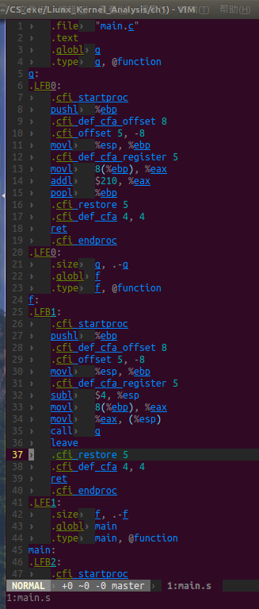
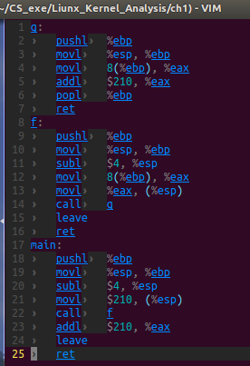

##一. 将c语言编译成汇编语言


```c
//main.c
int g(int x)
{
    return x + 210;
}

int f(int x)
{
    return g(x);
}

int main()
{
    return f(210) + 210;
}
```


```sh
$ gcc -S -o main.s main.c -m32
//-m32是因为汇编是基于32为的汇编语言的,而本编译系统为ubuntu 14.04 LTS 64位系统
```

```c
//main.s汇编语言,本例是删除.*文件,利于分析纯汇编语言
g:
	pushl	%ebp
	movl	%esp, %ebp
	movl	8(%ebp), %eax
	addl	$210, %eax
	popl	%ebp
	ret
f:
	pushl	%ebp
	movl	%esp, %ebp
	subl	$4, %esp
	movl	8(%ebp), %eax
	movl	%eax, (%esp)
	call	g
	leave
	ret
main:
	pushl	%ebp
	movl	%esp, %ebp
	subl	$4, %esp
	movl	$210, (%esp)
	call	f
	addl	$210, %eax
	leave
	ret
```

